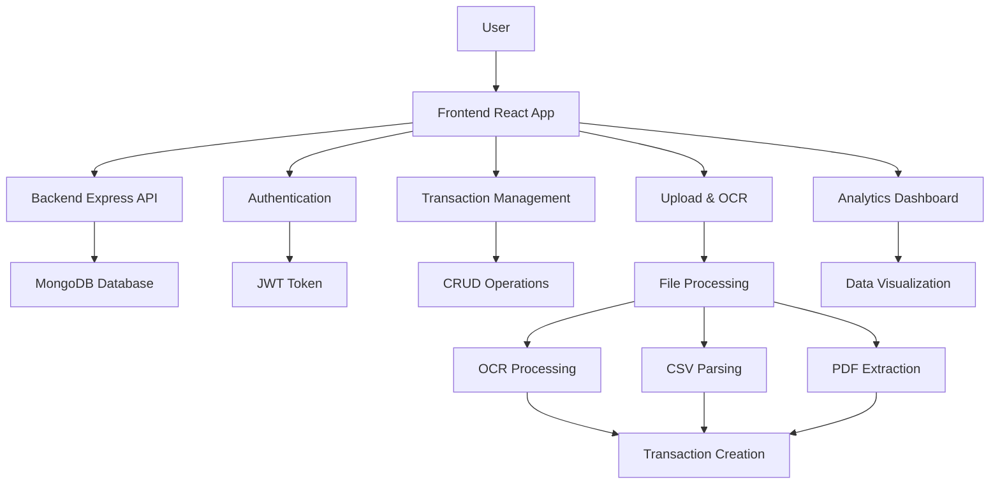
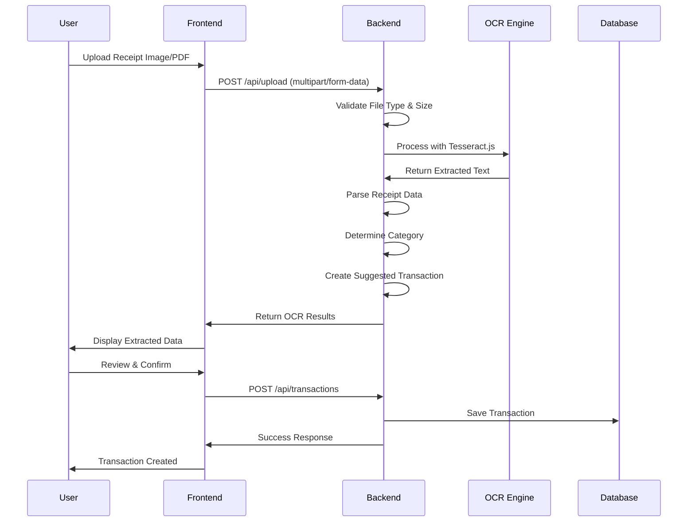
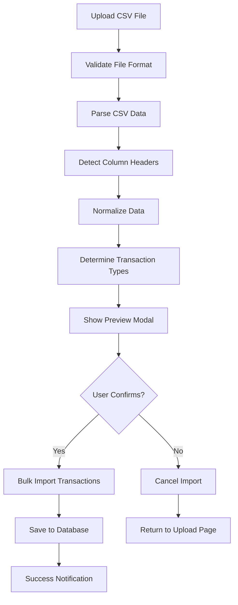
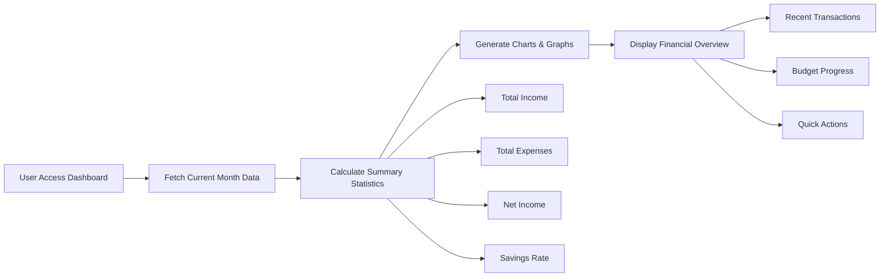
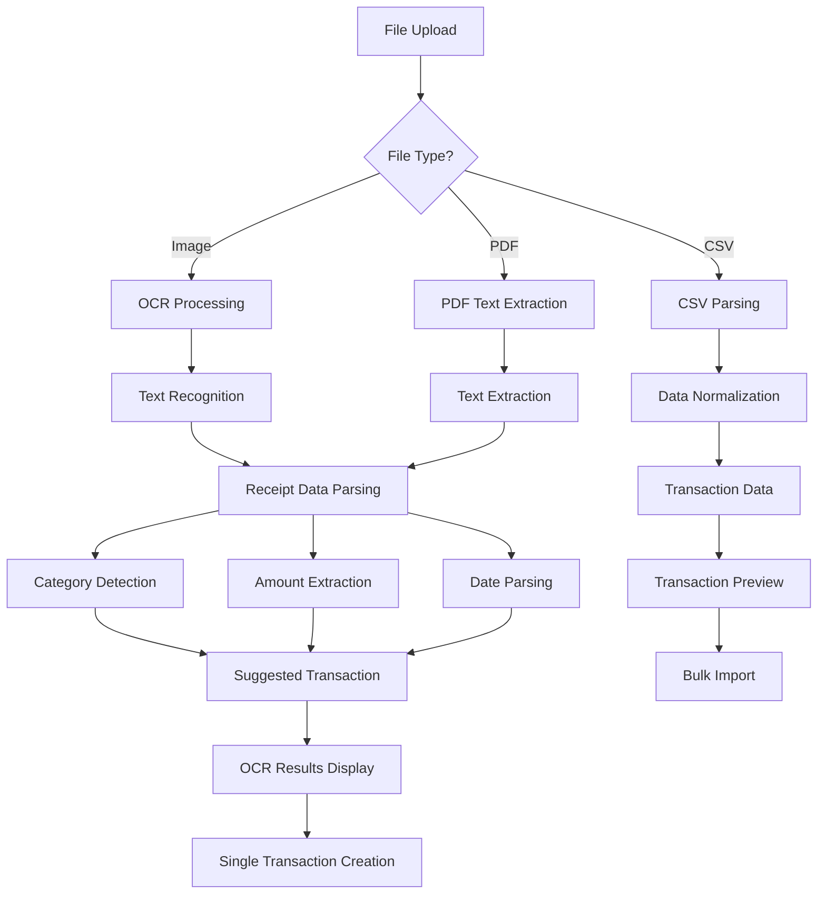

# Personal Finance Assistant

A modern, full-stack personal finance management application with OCR receipt processing, transaction tracking, and comprehensive analytics.

## Features

- **OCR Receipt Processing**: Upload receipts (JPG, PNG, PDF) and automatically extract transaction details
- **CSV/PDF Import**: Bulk import transactions from bank statements and financial apps
- **Transaction Management**: Track income, expenses, and categorize transactions
- **Analytics Dashboard**: Visual insights into spending patterns and financial health
- **Budget Tracking**: Set monthly budgets and monitor spending
- **Modern UI**: Beautiful, responsive design with gradient backgrounds and smooth animations

## Technology Stack

- **MERN Stack** - Used Mern stack
- **Tesseract.js** - OCR (Optical Character Recognition)
- **PDF-parse** - PDF text extraction
- **CSV-parser** - CSV file processing

## Installation

### Prerequisites
- Node.js (v14 or higher)
- MongoDB
- npm or yarn

### Backend Setup

1. **Clone the repository**
   ```bash
   git clone <repository-url>
   cd personal-finance-assistant
   ```

2. **Install backend dependencies**
   ```bash
   cd backend
   npm install
   ```

3. **Environment Configuration**
   Create a `.env` file in the backend directory:
   ```env
   MONGODB_URI=mongodb://localhost:27017/finance-tracker
   JWT_SECRET=your-secret-key
   PORT=5000
   NODE_ENV=development
   ```

4. **Start the backend server**
   ```bash
   npm run dev
   ```

### Frontend Setup

1. **Install frontend dependencies**
   ```bash
   cd frontend
   npm install
   ```

2. **Start the frontend development server**
   ```bash
   npm start
   ```

The application will be available at `http://localhost:3000`

## Usage

### OCR Receipt Processing

1. Navigate to the Upload page
2. Drag and drop or click to upload receipt images (JPG, PNG) or PDF files
3. The system will automatically extract transaction details using OCR
4. Review the extracted information and suggested transaction
5. Click "Create Transaction" to save the transaction

### CSV/PDF Import

1. Upload CSV files with transaction data
2. The system supports various CSV formats with automatic column detection
3. Review the imported transactions in the preview modal
4. Click "Import Transactions" to bulk import

### Transaction Management

1. Add transactions manually through the Transactions page
2. Categorize transactions for better organization
3. View transaction history and analytics
4. Set up monthly budgets and track spending

## API Documentation

### Authentication Endpoints

```http
POST /api/auth/register
POST /api/auth/login
GET /api/auth/profile
```

### Transaction Endpoints

```http
GET /api/transactions
POST /api/transactions
PUT /api/transactions/:id
DELETE /api/transactions/:id
GET /api/transactions/analytics/summary
```

### Upload Endpoints

```http
POST /api/upload
POST /api/upload/bulk-import
```

## Workflow Diagrams

### Application Overview



### OCR Upload Workflow



### CSV Import Workflow



### Dashboard Analytics Workflow



### File Processing Pipeline



## 🔧 Configuration

### Environment Variables

#### Backend (.env)
```env
MONGODB_URI=mongodb://localhost:27017/finance-tracker
JWT_SECRET=your-secret-key-here
PORT=5000
NODE_ENV=development
CORS_ORIGIN=http://localhost:3000
```

##  Deployment

### Production Build

1. **Backend**
   ```bash
   cd backend
   npm run build
   npm start
   ```

2. **Frontend**
   ```bash
   cd frontend
   npm run build
   ```


**Author : Y sai Koushik Reddy**
